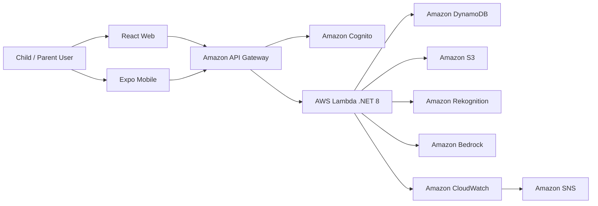

# GreenLens Kids
## AI Waste Learning Platform for Children
### A Unified AWS Serverless Solution for Playful Environmental Education

## 1. Executive Summary
GreenLens Kids is an educational platform that helps children learn how to classify waste through playful interaction, AI-powered feedback, quizzes, mini games, and rewards. The app is designed for children ages 6 to 12 and is centered around a child-friendly avatar identity, so learning feels like an adventure rather than a school exercise.

The platform combines a React web app, an Expo/React Native mobile app, and a .NET 8 backend with a planned AWS serverless architecture. Child progress is tracked through `childId`, while authentication and profile linkage can be handled silently through Amazon Cognito and DynamoDB. The result is a lightweight, scalable, and privacy-aware learning system that encourages repeated engagement and environmental habits over time.

## 2. Problem Statement

### What Is the Problem?
Children often learn about environmental responsibility through abstract explanations that are hard to remember and even harder to apply in real life. Waste classification is a practical skill, but most learning materials are passive, text-heavy, or disconnected from everyday situations.

At the same time, families and schools need a safe digital experience that is simple enough for children to use, but structured enough to track learning progress and rewards.

### The Solution
GreenLens Kids solves this by turning waste classification into an interactive learning loop:

- Create a child avatar and profile.
- Scan waste with an AI Camera.
- Receive instant classification and explanation.
- Answer short quiz questions.
- Play mini games to reinforce the lesson.
- Earn XP, badges, streaks, and rewards.

The platform uses AWS services such as API Gateway, Lambda, DynamoDB, Cognito, S3, Rekognition, and Bedrock to deliver real-time feedback with low operational overhead. AWS WAF, CloudWatch, and SNS can be added to improve protection, observability, and operational alerting.

### Benefits and Return on Investment
GreenLens Kids creates value in three ways:

1. It improves environmental literacy through hands-on learning.
2. It gives children a reusable learning journey that grows with their progress.
3. It provides a foundation for future AI-assisted educational features, analytics, and content personalization.

For implementation, the platform is intentionally designed to stay cost-conscious at small scale, especially during early development and pilot use. The main value comes from reusable software architecture, educational continuity, and the ability to expand the product over time without redesigning the core system.

## 3. Solution Architecture

GreenLens Kids uses a serverless AWS architecture to support child accounts, AI image analysis, quiz generation, rewards, and progress tracking.

### High-Level Architecture

### AWS Services Used

- **Amazon API Gateway**: exposes secure backend endpoints for auth, child profiles, AI Camera, quiz, and mini game flows.
- **AWS Lambda**: runs business logic for profile creation, image analysis orchestration, quiz generation, and reward updates.
- **Amazon Cognito**: manages user identity and token-based access.
- **Amazon DynamoDB**: stores child profiles, progress, streaks, quiz sessions, classifications, and reward state.
- **Amazon S3**: stores uploaded images, audio assets, static content, and generated resources.
- **Amazon Rekognition**: analyzes waste images and returns labels for classification.
- **Amazon Bedrock**: generates educational explanations and quiz content.
- **AWS WAF**: protects public endpoints and helps limit abuse.
- **Amazon CloudWatch**: captures logs, metrics, and alarms.
- **Amazon SNS**: sends operational alerts when needed.

### Component Design

- **Child Identity Layer**: creates an avatar-based identity instead of a traditional email/password flow.
- **AI Camera Layer**: accepts an image, runs classification, and returns a friendly explanation of the result.
- **Learning Layer**: transforms each classification into quiz questions and follow-up learning.
- **Game Layer**: reinforces knowledge through mini games, XP, and rewards.
- **Progress Layer**: tracks child history, streaks, badges, and completed activities.

## 4. Technical Implementation

### Implementation Phases
The project can be implemented in four phases:

1. **Product and Flow Design**  
   Define the avatar creation flow, AI Camera experience, quiz logic, and reward loop.

2. **Backend and Data Modeling**  
   Build the .NET 8 backend, create DynamoDB schemas, and define Cognito-based user linkage.

3. **AI and Content Integration**  
   Connect Rekognition for image labels and Bedrock for educational explanations and quiz generation.

4. **Frontend, Testing, and Deployment**  
   Implement the React web app and mobile app, test the end-to-end flow, and deploy the AWS resources.

### Technical Requirements

#### Child Profile and Avatar
- Avatar-based onboarding with hair, eyes, outfit, and name selection.
- A unique `childId` for progress tracking.
- Silent identity linkage with Cognito when AWS mode is enabled.

#### AI Camera
- Image upload or camera capture from web/mobile.
- Waste classification using Rekognition.
- Result screen with the waste category, explanation, and suggested action.

#### Quiz and Rewards
- Short quizzes generated from the AI result or from prebuilt content.
- XP, levels, streaks, badges, and reward progression.
- Persistent learning history stored in DynamoDB.

#### Backend and Infrastructure
- .NET 8 API layer.
- API Gateway and Lambda-based serverless endpoints.
- DynamoDB for progress and content state.
- S3 for media assets and temporary uploads.
- Cognito for secure access.

## 5. Timeline & Milestones

### Project Timeline

- **Phase 1: Planning and UX Design**
  - Define learning goals, child journey, and core screens.
  - Finalize feature scope for avatar, AI Camera, quiz, and rewards.

- **Phase 2: Core Backend**
  - Implement child profile creation and authentication linkage.
  - Build storage and progress tracking in DynamoDB.

- **Phase 3: AI Learning Loop**
  - Integrate Rekognition and Bedrock.
  - Implement quiz generation and result-based learning feedback.

- **Phase 4: Frontend and Release**
  - Complete the web and mobile experience.
  - Run end-to-end testing, polish UX, and prepare deployment.

## 6. Budget Estimation

GreenLens Kids is designed to stay efficient at small scale. The biggest cost drivers will typically be:

- API traffic through API Gateway
- Lambda execution
- DynamoDB reads and writes
- S3 storage for uploads and assets
- Rekognition and Bedrock usage for AI features

For early development and pilot testing, the architecture should remain low-cost if usage is controlled and media assets are managed carefully. A final budget should be confirmed with the AWS Pricing Calculator once the expected number of users, image scans, and quiz generations is known.

### Infrastructure Cost Considerations

- **Low-traffic pilot**: likely dominated by AI calls and storage.
- **Growth stage**: cost increases mainly with scans, quiz generation, and active users.
- **Optimization opportunities**: caching content, limiting image retention, and using prebuilt quiz pools where appropriate.

## 7. Risk Assessment

### Risk Matrix

- **AI Misclassification**: medium impact, medium probability.
- **Child UX Confusion**: high impact, medium probability.
- **Cost Growth from AI Usage**: medium impact, medium probability.
- **Data Privacy and Compliance**: high impact, low-to-medium probability.
- **Service Availability Issues**: medium impact, low probability.

### Mitigation Strategies

- Add fallback explanations and a retry flow when AI confidence is low.
- Keep the child journey simple, visual, and guided.
- Cache or reuse generated educational content where possible.
- Minimize stored personal data and keep child identity handling privacy-aware.
- Use CloudWatch alarms and alerting for operational visibility.

### Contingency Plans

- Fall back to prewritten quiz content when Bedrock is unavailable.
- Fall back to a safe "try again" flow when image confidence is too low.
- Keep a local development mode with in-memory storage for fast testing.

## 8. Expected Outcomes

### Educational Outcomes

- Children learn waste classification through repetition and play.
- Learning becomes more memorable because it is tied to real-world objects.
- The app encourages positive habits through streaks and rewards.

### Technical Outcomes

- A reusable AWS serverless foundation for future educational features.
- A clean child profile system linked to progress tracking.
- A scalable app structure that supports both web and mobile experiences.

### Long-Term Value

- A platform that can expand into broader environmental education topics.