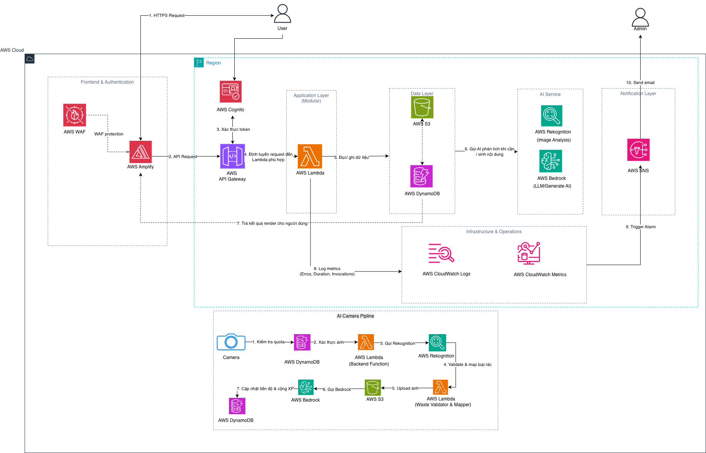
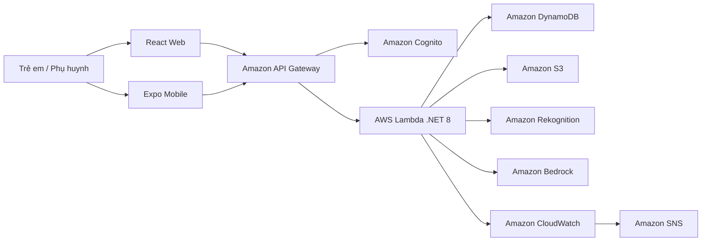

# GreenLens Kids
## Nền tảng học phân loại rác thông minh cho trẻ em
### Giải pháp AWS Serverless thống nhất cho giáo dục môi trường thông qua trải nghiệm vui chơi

## 1. Tóm tắt điều hành
GreenLens Kids là một nền tảng giáo dục giúp trẻ em học cách phân loại rác thông qua tương tác vui chơi, phản hồi do AI cung cấp, câu đố, trò chơi mini và phần thưởng. Ứng dụng hướng tới trẻ từ 6 đến 12 tuổi và tập trung vào một avatar thân thiện với trẻ em để việc học trở nên như một cuộc phiêu lưu thay vì một bài tập trên lớp.

Nền tảng kết hợp ứng dụng web bằng React, ứng dụng di động bằng Expo/React Native và backend .NET 8 với kiến trúc serverless trên AWS dự kiến. Tiến độ học tập của trẻ được theo dõi qua childId, trong khi xác thực và liên kết hồ sơ có thể được xử lý ngầm thông qua Amazon Cognito và DynamoDB. Kết quả là một hệ thống học tập nhẹ, có thể mở rộng và tôn trọng quyền riêng tư, khuyến khích trẻ tham gia thường xuyên và hình thành thói quen bảo vệ môi trường lâu dài.

## 2. Tuyên bố vấn đề

### Vấn đề là gì?
Trẻ em thường học về trách nhiệm với môi trường thông qua những lời giải thích trừu tượng, khó nhớ và thậm chí còn khó áp dụng vào thực tế. Phân loại rác là một kỹ năng thiết thực, nhưng hầu hết tài liệu học tập lại thụ động, quá nhiều chữ và thiếu liên hệ với các tình huống trong đời sống hàng ngày.

Đồng thời, phụ huynh và trường học cần một trải nghiệm kỹ thuật số an toàn, đủ đơn giản để trẻ em sử dụng, nhưng cũng đủ có cấu trúc để theo dõi tiến độ học tập và phần thưởng.

### Giải pháp
GreenLens Kids giải quyết vấn đề này bằng cách biến việc phân loại rác thành một vòng lặp học tập tương tác:

- Tạo avatar và hồ sơ cho trẻ.
- Quét rác bằng camera AI.
- Nhận kết quả phân loại ngay lập tức và giải thích.
- Trả lời các câu hỏi ngắn.
- Chơi các mini game để củng cố bài học.
- Nhận XP, huy hiệu, streak và phần thưởng.

Nền tảng sử dụng các dịch vụ AWS như API Gateway, Lambda, DynamoDB, Cognito, S3, Rekognition và Bedrock để cung cấp phản hồi theo thời gian thực với chi phí vận hành thấp. AWS WAF, CloudWatch và SNS có thể được thêm vào để cải thiện bảo vệ, khả năng quan sát và cảnh báo vận hành.

### Lợi ích và lợi tức đầu tư
GreenLens Kids tạo ra giá trị theo ba cách:

1. Nâng cao năng lực hiểu biết về môi trường thông qua học tập bằng thực hành.
2. Mang lại một hành trình học tập có thể tái sử dụng và phát triển theo tiến độ của trẻ.
3. Tạo nền tảng cho các tính năng giáo dục hỗ trợ AI trong tương lai, phân tích dữ liệu và cá nhân hóa nội dung.

Về triển khai, nền tảng được thiết kế chủ ý để tối ưu chi phí ở quy mô nhỏ, đặc biệt trong giai đoạn phát triển đầu và thử nghiệm pilot. Giá trị chính đến từ kiến trúc phần mềm có thể tái sử dụng, tính liên tục của giáo dục và khả năng mở rộng sản phẩm theo thời gian mà không cần thiết kế lại hệ thống cốt lõi.

## 3. Kiến trúc giải pháp

GreenLens Kids sử dụng kiến trúc AWS serverless để hỗ trợ tài khoản trẻ em, phân tích ảnh bằng AI, tạo câu đố, phần thưởng và theo dõi tiến độ.

### Kiến trúc cấp cao

### Các dịch vụ AWS được sử dụng

- **Amazon API Gateway**: cung cấp các endpoint backend an toàn cho xác thực, hồ sơ trẻ, AI Camera, câu đố và các luồng mini game.
- **AWS Lambda**: xử lý logic nghiệp vụ cho tạo hồ sơ, điều phối phân tích ảnh, tạo câu đố và cập nhật phần thưởng.
- **Amazon Cognito**: quản lý danh tính người dùng và truy cập bằng token.
- **Amazon DynamoDB**: lưu trữ hồ sơ trẻ, tiến độ, streak, phiên câu đố, kết quả phân loại và trạng thái phần thưởng.
- **Amazon S3**: lưu trữ ảnh tải lên, tài sản âm thanh, nội dung tĩnh và tài nguyên được tạo ra.
- **Amazon Rekognition**: phân tích ảnh rác và trả về nhãn để phân loại.
- **Amazon Bedrock**: tạo giải thích giáo dục và nội dung câu đố.
- **AWS WAF**: bảo vệ các endpoint công khai và giảm hành vi lạm dụng.
- **Amazon CloudWatch**: ghi nhận log, metric và cảnh báo.
- **Amazon SNS**: gửi cảnh báo vận hành khi cần.

### Thiết kế thành phần

- **Lớp nhận diện trẻ em**: tạo một định danh dựa trên avatar thay vì luồng email/mật khẩu truyền thống.
- **Lớp AI Camera**: nhận ảnh, chạy phân loại và trả về giải thích thân thiện với kết quả.
- **Lớp học tập**: biến mỗi lần phân loại thành các câu hỏi quiz và học tập tiếp nối.
- **Lớp game**: củng cố kiến thức qua mini games, XP và phần thưởng.
- **Lớp tiến độ**: theo dõi lịch sử học tập, streak, huy hiệu và các hoạt động đã hoàn thành.

## 4. Triển khai kỹ thuật

### Các giai đoạn triển khai
Dự án có thể được triển khai theo bốn giai đoạn:

1. **Thiết kế sản phẩm và luồng tương tác**  
   Xác định luồng tạo avatar, trải nghiệm AI Camera, logic câu đố và vòng phần thưởng.

2. **Backend và mô hình dữ liệu**  
   Xây dựng backend .NET 8, tạo schema DynamoDB và định nghĩa liên kết dựa trên Cognito.

3. **Tích hợp AI và nội dung**  
   Kết nối Rekognition để nhận nhãn ảnh và Bedrock để tạo giải thích giáo dục và nội dung câu đố.

4. **Frontend, kiểm thử và triển khai**  
   Triển khai ứng dụng web React và ứng dụng di động, kiểm thử toàn bộ quy trình và triển khai các tài nguyên AWS.

### Yêu cầu kỹ thuật

#### Hồ sơ trẻ em và avatar
- Onboarding theo avatar với lựa chọn tóc, mắt, trang phục và tên.
- Có một unique childId để theo dõi tiến độ.
- Liên kết danh tính ngầm với Cognito khi chế độ AWS được bật.

#### AI Camera
- Tải ảnh hoặc chụp ảnh trực tiếp từ web/mobile.
- Phân loại rác bằng Rekognition.
- Màn hình kết quả hiển thị danh mục rác, giải thích và đề xuất hành động.

#### Quiz và phần thưởng
- Các câu hỏi ngắn được tạo từ kết quả AI hoặc từ nội dung có sẵn.
- XP, cấp độ, streak, huy hiệu và tiến trình phần thưởng.
- Lịch sử học tập được lưu trữ lâu dài trong DynamoDB.

#### Backend và hạ tầng
- API layer .NET 8.
- Các endpoint serverless qua API Gateway và Lambda.
- DynamoDB cho tiến độ và trạng thái nội dung.
- S3 cho tài sản media và upload tạm.
- Cognito để bảo mật truy cập.

## 5. Lộ trình & cột mốc

### Lộ trình dự án

- **Giai đoạn 1: Lập kế hoạch và thiết kế UX**
  - Xác định mục tiêu học tập, hành trình của trẻ và các màn hình cốt lõi.
  - Hoàn thiện phạm vi tính năng cho avatar, AI Camera, quiz và phần thưởng.

- **Giai đoạn 2: Backend cốt lõi**
  - Triển khai tạo hồ sơ trẻ em và liên kết xác thực.
  - Xây dựng lưu trữ và theo dõi tiến độ trong DynamoDB.

- **Giai đoạn 3: Vòng lặp học tập bằng AI**
  - Tích hợp Rekognition và Bedrock.
  - Triển khai tạo câu đố và phản hồi học tập dựa trên kết quả.

- **Giai đoạn 4: Frontend và phát hành**
  - Hoàn thiện trải nghiệm web và mobile.
  - Chạy kiểm thử end-to-end, tinh chỉnh UX và chuẩn bị triển khai.

## 6. Ước tính ngân sách

GreenLens Kids được thiết kế để vẫn hiệu quả ở quy mô nhỏ. Các yếu tố chi phí lớn thường bao gồm:

- Lưu lượng truy cập qua API Gateway
- Thực thi Lambda
- Đọc/ghi DynamoDB
- Bảo quản S3 cho upload và tài sản
- Sử dụng Rekognition và Bedrock cho tính năng AI

Trong giai đoạn phát triển đầu và thử nghiệm pilot, kiến trúc nên giữ chi phí thấp nếu mức sử dụng được kiểm soát và tài sản media được quản lý cẩn thận. Ngân sách cuối cùng nên được xác nhận với AWS Pricing Calculator khi biết số lượng người dùng dự kiến, số lần quét ảnh và số lần tạo câu đố.

### Các yếu tố chi phí hạ tầng

- **Pilot lưu lượng thấp**: chủ yếu bị chi phối bởi AI calls và lưu trữ.
- **Giai đoạn tăng trưởng**: chi phí tăng chủ yếu do số lần quét ảnh, số lần tạo quiz và số người dùng hoạt động.
- **Cơ hội tối ưu**: cache nội dung, giới hạn thời gian lưu ảnh và dùng bộ quiz dựng sẵn ở mức phù hợp.

## 7. Đánh giá rủi ro

### Ma trận rủi ro

- **Nhầm lớp AI**: tác động trung bình, xác suất trung bình.
- **Trải nghiệm người dùng trẻ em bị rối**: tác động cao, xác suất trung bình.
- **Chi phí tăng do sử dụng AI**: tác động trung bình, xác suất trung bình.
- **Bảo mật dữ liệu và tuân thủ**: tác động cao, xác suất thấp đến trung bình.
- **Sự cố khả dụng dịch vụ**: tác động trung bình, xác suất thấp.

### Chiến lược giảm thiểu

- Thêm giải thích dự phòng và luồng thử lại khi độ tin cậy AI thấp.
- Giữ hành trình của trẻ đơn giản, trực quan và có hướng dẫn.
- Cache hoặc dùng lại nội dung giáo dục đã tạo.
- Giảm thiểu dữ liệu cá nhân lưu trữ và xử lý danh tính trẻ một cách bảo mật.
- Dùng CloudWatch alarms và cảnh báo để quan sát vận hành.

### Kế hoạch dự phòng

- Dùng nội dung quiz có sẵn khi Bedrock không khả dụng.
- Dùng luồng "thử lại" an toàn khi độ tin cậy hình ảnh quá thấp.
- Giữ chế độ phát triển cục bộ với lưu trữ bộ nhớ cho việc thử nghiệm nhanh.

## 8. Kết quả kỳ vọng

### Kết quả giáo dục

- Trẻ học cách phân loại rác thông qua lặp lại và vui chơi.
- Việc học trở nên dễ nhớ hơn vì gắn với các vật thể trong thế giới thực.
- Ứng dụng khuyến khích thói quen tích cực qua streak và phần thưởng.

### Kết quả kỹ thuật

- Một nền tảng AWS serverless có thể tái sử dụng cho các tính năng giáo dục trong tương lai.
- Một hệ thống hồ sơ trẻ em sạch sẽ liên kết với theo dõi tiến độ.
- Một cấu trúc ứng dụng có thể mở rộng cho cả web và mobile.

### Giá trị dài hạn

- Một nền tảng có thể mở rộng sang các chủ đề giáo dục môi trường rộng hơn.