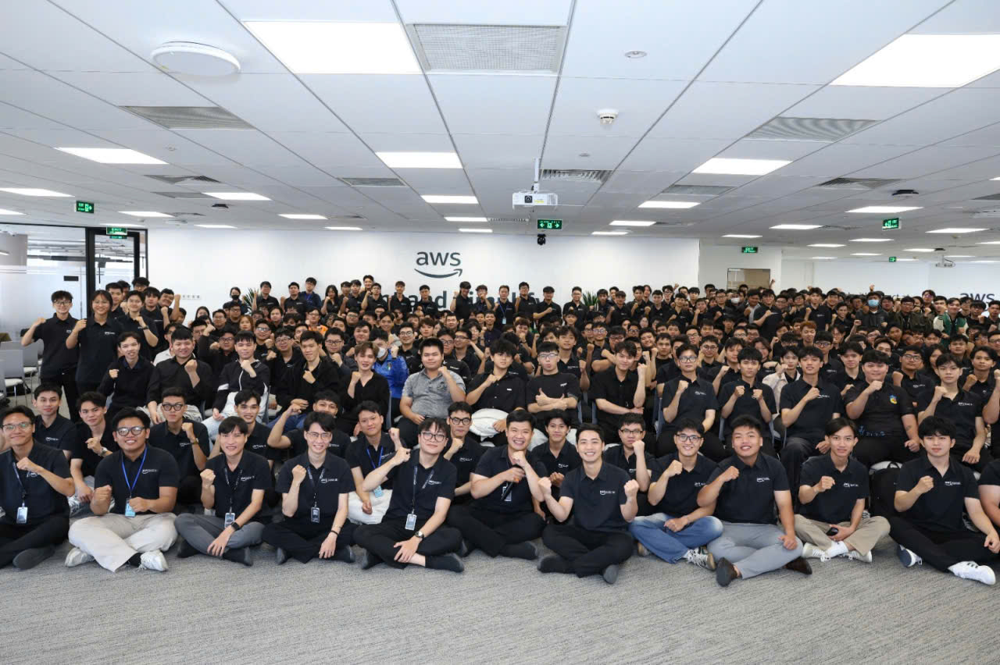

# Báo cáo sự kiện: "Buổi chia sẻ kiến thức công nghệ cuối tuần"

### Mục tiêu của sự kiện

* Thúc đẩy tinh thần tự học và phát triển bản thân liên tục trong lĩnh vực công nghệ.
* Khám phá các kỹ thuật AI thực tiễn nhằm tối ưu hóa hiệu suất phát triển phần mềm.
* Giới thiệu các phương pháp luận và quy trình phát triển hiện đại có sự hỗ trợ của AI.
* Định hướng nghề nghiệp và xây dựng tư duy vững vàng cho sinh viên chuẩn bị gia nhập thị trường việc làm công nghệ.

### Diễn giả tham gia

* **Huỳnh Hoàng Long** – Addicted to Learning Like You're Addicted to Social Media
* **Thịnh Nguyễn** – Automated Prompt Engineering: Enhancing LLM Output Quality
* **Khang Nguyễn** – Career Opportunities & Mindset for Entering the Job Market
* **Nguyễn Phương Thảo** – BMAD Method – AI-Driven Development Workflow

### Nội dung trọng tâm

#### Addicted to Learning Like You're Addicted to Social Media

* Xây dựng thói quen học tập đều đặn và tự nhiên như việc lướt mạng xã hội mỗi ngày.
* Thay vì học đối phó, hãy thiết lập một hệ thống tích lũy kiến thức chủ động và bền vững.
* Nuôi dưỡng sự tò mò để liên tục cập nhật và đón đầu các công nghệ mới nổi.
* Các mẹo thực tế để duy trì động lực nội tại và nâng cao hiệu quả học tập dài hạn.

#### Automated Prompt Engineering: Enhancing LLM Output Quality

* Giới thiệu dự án cá nhân chuyên sâu về tối ưu hóa Prompt tự động (Automated Prompt Engineering).
* Nâng cao độ chính xác và chất lượng phản hồi của các mô hình LLM thông qua thuật toán tối ưu hóa cấu trúc câu lệnh.
* Giảm thiểu việc tinh chỉnh Prompt thủ công trong khi vẫn tăng tính đồng nhất của dữ liệu đầu ra.
* Các ứng dụng thực tiễn của kỹ nghệ prompt tự động trong việc phát triển các ứng dụng AI.

#### Career Opportunities & Mindset for Entering the Job Market

* Phân tích các xu hướng tuyển dụng hiện nay và cơ hội phát triển trong ngành công nghệ thông tin.
* Xác định các kỹ năng cứng lẫn kỹ năng mềm cốt lõi mà sinh viên cần trang bị trước khi ra trường.
* Nhấn mạnh tầm quan trọng của tư duy giải quyết vấn đề, năng lực làm việc nhóm và giao tiếp hiệu quả.
* Phương pháp xây dựng một portfolio ấn tượng dựa trên các trải nghiệm dự án thực tế.

#### BMAD Method – AI-Driven Development Workflow

* Tổng quan về framework BMAD được thiết kế riêng cho việc phát triển phần mềm có sự hỗ trợ của AI.
* Cách thức vận hành các AI agents nhằm hỗ trợ các giai đoạn khác nhau trong vòng đời phát triển phần mềm (SDLC).
* Tối ưu hóa các khâu từ phân tích yêu cầu, lập kế hoạch, viết mã nguồn cho đến kiểm thử phần mềm bằng AI.
* Chia sẻ repository mã nguồn mở của phương pháp BMAD như một tài nguyên học tập thực hành chất lượng.

### Những bài học cốt lõi

#### Phát triển cá nhân
* **Học tập suốt đời** cần phải trở thành một thói quen hằng ngày thay vì chỉ là một mục tiêu ngắn hạn.
* Sự tăng trưởng chuyên môn trong dài hạn phụ thuộc rất lớn vào việc xây dựng một lộ trình học tập có cấu trúc bài bản.
* Giữ vững sự tò mò kỹ thuật giúp các lập trình viên dễ dàng thích nghi trước sự thay đổi chóng mặt của công nghệ.

#### Kỹ nghệ AI
* **Prompt Engineering** là yếu tố quyết định để khai thác tối đa và nâng cao chất lượng phản hồi từ LLM.
* Việc áp dụng tối ưu hóa prompt tự động giúp đẩy nhanh đáng kể tốc độ bàn giao sản phẩm phần mềm.
* Vai trò của AI không chỉ dừng lại ở việc sinh code tự động mà còn tối ưu toàn bộ vòng đời của dự án.

#### Phát triển sự nghiệp
* Nhà tuyển dụng hiện đại đánh giá cao những ứng viên có sự cân bằng giữa chiều sâu kỹ thuật và kỹ năng tương tác xã hội.
* Việc sở hữu một portfolio mạnh đi kèm với kinh nghiệm thực hành dự án sẽ giúp gia tăng vượt trội khả năng trúng tuyển.
* Tư duy phát triển (growth mindset) tạo ra lợi thế cạnh tranh bền vững trong suốt lộ trình thăng tiến sự nghiệp.

#### Tối ưu hóa quy trình
* Các framework phát triển hướng AI giúp nâng tầm đáng kể hiệu suất vận hành của các đội ngũ kỹ sư.
* Tích hợp các trợ lý AI vào giai đoạn lên kế hoạch và kiểm thử giúp rút ngắn tối đa thời gian triển khai dự án.
* Các phương pháp luận mã nguồn mở là những quy chuẩn tham chiếu tuyệt vời để hiện đại hóa quy trình kỹ nghệ phần mềm.

### Kế hoạch hành động & Áp dụng thực tế

* Thiết lập một thời gian biểu học tập có hệ thống mỗi ngày để cập nhật các công nghệ mới.
* Áp dụng các kỹ thuật Prompt Engineering bài bản để nâng cao chất lượng cho các ứng dụng tích hợp AI.
* Thử nghiệm framework BMAD để làm quen với các mô hình phát triển phần mềm có sự hỗ trợ của AI.
* Tự xây dựng và hoàn thiện các dự án cá nhân để làm phong phú thêm portfolio chuyên nghiệp của bản thân.
* Chủ động rèn luyện kỹ năng giao tiếp, phối hợp nhóm và tư duy phản biện song song với năng lực lập trình cốt lõi.

#### Cảm nhận về sự kiện
* Việc tham gia Buổi chia sẻ kiến thức cuối tuần mang lại giá trị rất lớn, giúp em có góc nhìn sâu sắc hơn về thói quen tự học, kỹ nghệ hướng AI và định hướng nghề nghiệp. Sự kết hợp giữa trải nghiệm thực tế của diễn giả, các phần demo kỹ thuật và lộ trình nghề nghiệp đã mang đến một bản kế hoạch rõ ràng mà em có thể áp dụng trực tiếp vào các dự án sắp tới.

#### Học hỏi từ các chuyên gia
* Các diễn giả đã đem đến những góc nhìn rất thực tế về việc tự giáo dục, xu hướng AI và cách định vị bản thân trên thị trường việc làm.
* Các case study thực tế đã minh chứng rõ ràng việc kết hợp giữa một hệ thống học tập tốt và công cụ AI có thể tăng tốc sự phát triển chuyên môn mạnh mẽ như thế nào.

#### Tiếp cận kỹ thuật thực tế
* Hiểu được cách Automated Prompt Engineering mang lại sự ổn định và chất lượng cao cho các hệ thống Generative AI.
* Khám phá cách điều phối AI linh hoạt qua các chuỗi giai đoạn dự án khác nhau bằng phương pháp BMAD.
* Nắm bắt cách các lập trình viên hiện đại phối hợp với các AI agents từ khâu thu thập yêu cầu ban đầu cho đến triển khai và kiểm thử.

#### Sử dụng các công cụ hiện đại
* Nhận diện framework BMAD như một công cụ mạnh mẽ cho quy trình phát triển cộng tác cùng AI hiện đại.
* Tích lũy các chiến lược thực tế để đưa các công cụ thông minh vào quy trình lập trình và viết mã nguồn hằng ngày.
* Tiếp cận các kho lưu trữ mã nguồn mở được thiết kế để hỗ trợ các quy trình kỹ nghệ phần mềm ứng dụng AI.

#### Thảo luận và kết nối
* Không gian tương tác mở đã tạo cơ hội tuyệt vời để trao đổi ý tưởng với các kỹ sư giàu kinh nghiệm và những người đam mê AI.
* Các phiên thảo luận bàn tròn về xây dựng sự nghiệp đã chỉ ra các cột mốc rõ ràng cho việc phát triển bản thân và mức độ sẵn sàng thích nghi với môi trường công sở.
* Sự kiện tái khẳng định rằng thành công lâu dài trong ngành công nghệ đòi hỏi sự kết hợp hài hòa giữa chuyên môn kỹ thuật và năng lực phát triển cá nhân liên tục.

#### Các nguyên tắc cốt lõi rút ra được
* Chủ động tiếp thu kiến thức vẫn là yếu tố quan trọng nhất để giữ cho bản thân không bị tụt hậu trong ngành công nghệ.
* AI đang tiến hóa từ một công cụ cơ bản thành một "trợ lý phi công" (co-pilot) không thể thiếu trong toàn bộ đường ống kỹ nghệ.
* Tận dụng tối ưu hóa câu lệnh và quy trình AI giúp nhân chuỗi hiệu suất đầu ra của cả cá nhân lẫn tập thể.
* Sẵn sàng cho sự nghiệp đòi hỏi sự tập trung đồng đều vào năng lực chuyên môn, portfolio thực tế và một tư duy kiên định.

#### Một số hình ảnh tại sự kiện

> Tóm lại, "Buổi chia sẻ kiến thức công nghệ cuối tuần" đã mang lại những hiểu biết sâu sắc và thực tiễn về tư duy kỹ nghệ hiện đại, quy trình làm việc với AI và lộ trình phát triển sự nghiệp. Nhờ vào phần trình bày chi tiết của các diễn giả, em đã hiểu rõ hơn cách cấu trúc hệ thống tự học cũng như cách tích hợp AI vào quy trình phát triển phần mềm. Toàn bộ buổi chia sẻ đã truyền cảm hứng rất lớn, thúc đẩy em tập trung cải thiện bản thân và ứng dụng tự động hóa AI vào công việc kỹ thuật hằng ngày.