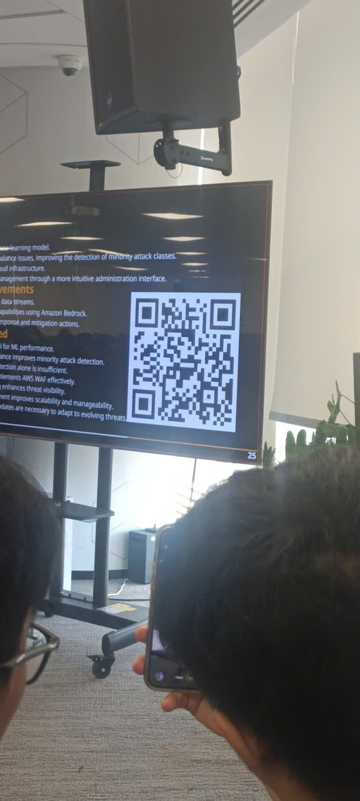

# Event Report: "FCAJ Community Day"

### Objectives of the Event

* Bridge the gap between foundational IT operations and cutting-edge cloud, security, and AI paradigms.
* Investigate hands-on containerization and advanced networking architectures that directly enhance system efficiency.
* Present modern security and data retrieval workflows centered around Machine Learning and GraphRAG technologies.
* Deliver actionable career advice, operational mindsets, and collaboration frameworks for technical professionals.

### Featured Speakers

* **Bảo Huỳnh** – Docker - A containerization technology
* **Lê Hoàng Gia Đại** – Combining AWS WAF with Machine Learning for Cyber Attack Detection on AWS
* **Nguyễn Quốc Bảo** – Topic: Multiplayer in the Cloud: Connecting Godot Clients with AWS WebSockets
* **Trương Huy Phước** – Topic: Cách làm việc nhóm hiệu quả
* **Việt Phát** – Topic: AWS Neptune for Building a Graph Knowledge Base for GraphRAG
* **Vinh Trần** – Topic: Từ IT Helpdesk lên Senior Sysadmin: Hành trình tự học và Lộ trình dịch chuyển sang Cloud/DevOps

### Key Highlights

#### Docker - A Containerization Technology

* Providing a comprehensive architectural breakdown comparing traditional, heavy Virtual Machines against lightweight Containers.
* Explaining how containers share the host operating system to boot in milliseconds and radically minimize resource consumption.
* Showcasing Docker's core philosophy of "build once, run anywhere" to streamline software deployment.

#### Combining AWS WAF with Machine Learning for Cyber Attack Detection on AWS

* Detailing the creation of a Machine Learning-based Network Intrusion Detection System (NIDS) to protect cloud infrastructure.
* Achieving a high 95.86% accuracy rate utilizing the LightGBM model trained on the CSE-CIC-IDS2018 dataset.
* Overcoming the rule-based limitations of traditional AWS WAF solutions when dealing with complex zero-day exploits.

#### Topic: Multiplayer in the Cloud: Connecting Godot Clients with AWS WebSockets

* Exploring real-time multiplayer game architecture connecting Godot 4 clients via resilient cloud networks.
* Utilizing AWS WebSockets alongside API Gateway, Lambda, and DynamoDB to manage active player states.
* Addressing real-time cloud infrastructure challenges like stale connections and mapping an upgrade path to AWS GameLift.

#### Topic: Cách làm việc nhóm hiệu quả

* Defining the "4 Golden Rules" of team collaboration: Clear Goals, Right Placement, Open Communication, and Personal Accountability.
* Optimizing project management pipelines by integrating modern automated tools into the team workflow.
* Demonstrating practical DevOps communication by setting up automated GitLab and ClickUp notifications directly inside Discord.

#### Topic: Cách làm việc nhóm hiệu quả

* Addressing the lack of multi-hop reasoning capabilities found in traditional, vector-only RAG systems.
* Introducing GraphRAG to uncover deep entity relationships and enable complex cross-document reasoning.
* Comparing a fully managed deployment path (Bedrock Knowledge Bases + Neptune Analytics) against a custom route utilizing LlamaIndex and Claude 3.5 Sonnet.

#### Topic: Từ IT Helpdesk lên Senior Sysadmin: Hành trình tự học và Lộ trình dịch chuyển sang Cloud/DevOps

* Sharing a realistic career roadmap guiding engineers from entry-level Helpdesk to Senior Sysadmin and DevOps roles.
* Emphasizing hands-on learning through dedicated Linux labs to master core infrastructure competencies.
* Instilling a disciplined operational mindset focused on stability, famously summarized as "never test in production".
* Transitioning successfully from legacy on-premise infrastructure to modern cloud-native practices using AWS, Terraform, and CI/CD.

### Essential Takeaways

#### Career Advancement
* **Practical portfolios** built through hands-on labs carry significantly more weight in career advancement than surface-level certifications.
* Progressing into senior engineering roles requires building deep core skills combined with a proactive learning attitude.

#### Architectural Modernization
* Upgrading from legacy on-premise setups or heavy VMs to cloud containers drastically improves overall resource efficiency.
* Modern application scalability relies heavily on persistent WebSockets and automated Infrastructure as Code (IaC).

#### Intelligent Security
* Static, signature-based firewall rules are no longer sufficient to stop highly complex network threats.
* Integrating behavior-based Machine Learning models provides an essential, adaptive layer of defense against zero-day exploits.

#### Advanced Contextual Retrieval
* Embedding GraphRAG structures into Large Language Model workflows bypasses the semantic blind spots of standard vector-only solutions.
* Combining knowledge graphs with LLMs allows enterprise systems to execute multi-hop reasoning across vast documentation.

#### Workflow Optimization
* Delivering successful enterprise projects demands a disciplined operations mindset backed by thorough documentation.
* Unifying development tools like GitLab and ClickUp with communication channels reduces operational friction and maximizes team output.

### Action Plan & Practical Application

* Set up dedicated Linux and cloud lab environments to transition skills from on-premise to cloud-native practices.
* Incorporate Docker containerization into deployment workflows to maximize resource utilization and application portability.
* Explore behavior-based Machine Learning models like LightGBM to complement traditional rule-based web application firewalls.
* Experiment with AWS WebSockets and API Gateway to build scalable, real-time backend architectures for client applications.
* Implement automated communication webhooks between project management tools and chat platforms to streamline team transparency.
* Evaluate GraphRAG architectures using LlamaIndex or fully managed AWS services to upgrade organizational knowledge retrieval.

#### Reflection on the Session
* Participating in the FCAJ Community Day provided immense value, shedding light on proactive system administration, cloud modernization, intelligent security, and advanced AI retrieval. The blend of personal career trajectories, deep technical walkthroughs, and team collaboration frameworks offers a clear blueprint that I can directly apply to my upcoming cloud projects and professional journey.

#### Insights from Industry Experts
* The guest speakers provided highly practical perspectives on navigating the shift from traditional IT infrastructure to cloud-native ecosystems.
* Real-world case studies effectively illustrated how combining modern architectural patterns with automated workflows can supercharge system reliability and team efficiency.

#### Technical Exposure
* Discovered how GraphRAG resolves the multi-hop reasoning limitations of traditional vector-based RAG using Bedrock and Neptune.
* Explored the implementation of Machine Learning-driven NIDS using LightGBM to protect cloud environments from zero-day exploits.
* Understood how modern developers utilize persistent WebSockets over AWS to orchestrate real-time multiplayer clients.

#### Adopting Modern Tooling
* Recognized Docker as an indispensable tool for lightweight, highly portable containerized application deployment.
* Gathered practical strategies for embedding automated infrastructure tools like Terraform and CI/CD pipelines into daily operations.
* Accessed technical blueprints regarding fully managed cloud services like AWS GameLift, Bedrock Knowledge Bases, and Neptune Analytics.

#### Collaborative Discussions
* The interactive environment facilitated a great exchange of ideas with seasoned system administrators, cloud engineers, and AI enthusiasts.
* Panel discussions around effective teamwork provided clear milestones for personal growth, accountability, and operational excellence.
* The session reinforced the idea that long-term tech success requires a combination of architectural mastery, continuous adaptation, and strong communication.

#### Key Principles Learned
* A disciplined operations mindset ("never test in production") remains a critical factor for maintaining high-availability systems.
* Cloud architecture is evolving from static, isolated deployments into highly integrated, intelligent, and real-time ecosystems.
* Leveraging behavior-based machine learning and automated workflows drastically multiplies individual and team capabilities.
* True technical readiness demands equal focus on hands-on portfolio building, domain-specific deep dives, and adaptive problem-solving skills.

#### Event Visuals

> In summary, the "FCAJ Community Day" offered deep, actionable knowledge regarding modern engineering mindsets, cloud-native architectures, intelligent security, and advanced AI integrations. Thanks to the thorough presentations from the speakers, I gained a clearer understanding of how to transition from legacy systems to highly automated cloud ecosystems. The entire session was highly motivating, inspiring me to focus on constant self-improvement and embrace cloud automation in my daily technical work.